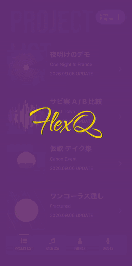
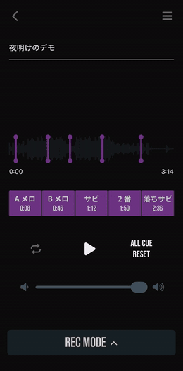

<div align="center">
  
  <p><strong>YOUR MUSIC. YOUR WORDS.</strong></p>
  <p>WRITE / RECORD / PLAY — 一瞬で名曲を生み出すために</p>
  <p>
    <a href="https://flexqstudio.com/">公式サイト</a> ·
    <a href="#アプリ概要">アプリ概要</a> ·
    <a href="#app-preview">App Preview</a> ·
    <a href="#技術スタック">技術スタック</a> ·
    <a href="#ローカルでの開発環境導入手順">開発環境</a> ·
    <a href="#テスト">テスト</a> ·
    <a href="#ブランチ運用とデプロイフロー">デプロイ</a>
  </p>
</div>

---

## アプリ概要

**FlexQ** は、シンガー・ラッパー・クリエイターのための音楽制作サポートアプリです。

音源の好きな位置から何度でもすぐに再生できる「CUE 機能」で、作詞・歌詞制作をよりスムーズに。さらに「REC 機能」を使えば、思いついたフレーズや歌声をその場ですぐに録音し、簡単に共有できます。聴く、書く、録る、共有する。FlexQ が、あなたの音楽制作をもっと自由に、もっとスピーディーにします。

iPhone / Android の両方に対応し、全機能を無料で利用できます（App Store / Google Play で配信）。

### 3 CORE FEATURES

| | 機能 | 説明 |
| --- | --- | --- |
| **01 — CUE** | **作りたい場所へ、ワンタップ。** | 音源の好きな位置に CUE ポイントを設定。A メロ、サビなど、制作したいパートをワンタップで何度でも繰り返し再生できます。巻き戻しやシーク操作の手間をなくし、作詞やフレーズ制作に集中できる環境をつくります。 |
| **02 — REC** | **思いついた瞬間、そのまま録る。** | 浮かんだメロディやフロウ、歌い回しを、その場ですぐにレコーディング。音源を聴きながらアイデアを録音できるので、スマホひとつでデモ制作までスムーズに進められます。録音したデータを共有し、メンバーやクリエイターとのやり取りもスピーディーに。 |
| **03 — WRITE** | **聴きながら、そのまま書く。** | 音源を再生しながら、思いついた歌詞やアイデアをその場で書き留められます。音楽を聴く、歌詞を書く、また聴き直す。その一連の作詞フローを FlexQ ひとつで完結。アプリを行き来することなく、浮かんだ言葉を逃さず歌詞に落とし込めます。 |

### そのほかの主な機能

- **トラック同時再生** — 録音したテイクを、録音時の位置に合わせてトラックと同時に再生（声とトラックをサンプル単位で同期する専用エンジン `react-native-audio-api` を使用）
- **AI クリーンアップ** — 録音からトラックのかぶりやノイズを取り除き、声だけを抽出（Replicate の demucs モデルでサーバーサイド処理）
- **クイックメモ / クイック録音** — プロジェクトを作らなくても、思いついた歌詞やメロディをすぐに書き留め・録音できる（DRAFTS タブ）。音声入力による歌詞の文字起こしにも対応
- **音源の取り込み** — 端末内の mp3 / wav をプロジェクトに取り込み、ID3 タグのアートワークも自動で読み取る
- **共有・書き出し** — 歌詞はテキストとして、録音は音声ファイル（トラックとのミックス込み）として他のアプリへ共有できる
- **アカウント** — メールアドレス（認証コード付き）または Google アカウントで登録。パスワードリセット・退会に対応

---

## App Preview

| PROJECT LIST | PROJECT EDITOR | TRACK LIST | QUICK RECORD |
| :---: | :---: | :---: | :---: |
|  |  |  |  |
| 作詞プロジェクトの一覧。タップで編集画面へ | CUE ポイントを置いて、聴きながら書く | 取り込んだ音源の管理・再生 | DRAFTS タブからその場で録音 |

> 画面収録は公式サイト（[flexqstudio.com](https://flexqstudio.com/)）の APP PREVIEW と同じ素材（`lyrics-web-frontend/public/preview/*.mp4`・iPhone 17 Pro シミュレーターで収録）から、ステータスバー（上端 62pt）を切り落として GIF 化したものです。差し替えるときは次のコマンドで再生成します。
>
> ```bash
> # lyrics-web-frontend/public/preview/<name>.mp4 → docs/readme/<name>.gif
> ffmpeg -i <name>.mp4 \
>   -vf "crop=750:1514:0:116,fps=10,scale=260:-1:flags=lanczos,split[s0][s1];[s0]palettegen=max_colors=128[p];[s1][p]paletteuse=dither=bayer:bayer_scale=5" \
>   -loop 0 docs/readme/<name>.gif
> ```

---

## 技術スタック

### コア技術

| 項目         | バージョン / 内容 |
| ------------ | ----------------- |
| React Native | 0.81.5（New Architecture 有効） |
| Expo SDK     | 54（`runtimeVersion` 1.1.0） |
| React        | 19.1.0            |
| TypeScript   | 5.9.3             |
| Node.js      | 20.11.0           |
| Yarn         | 4.12.0 (Berry)    |

### ナビゲーション

- **React Navigation**（Stack + Bottom Tabs）を採用。`src/app/_layout.tsx` がエントリーポイントで、フォント読み込み・API クライアント初期化・`RootNavigator` のレンダリングを担当します
  - `@react-navigation/native` / `stack` / `bottom-tabs` 7.x
  - `RootNavigator` が認証ゲート（認証済み → `HomeTabs`、未認証 → `SignIn`）
  - `HomeTabsNavigator` はカスタム `NavigationBar` を使った 4 タブ（PROJECT LIST / TRACK LIST / PROFILE / DRAFTS）
  - 編集・再生・録音などのオーバーレイ系画面はスタックにプッシュ

### 主要ライブラリ

| カテゴリ               | ライブラリ                                                                 |
| ---------------------- | -------------------------------------------------------------------------- |
| 状態管理               | React Context（`AuthContext` / `ModalContext` / `ForegroundRefreshContext`） |
| 録音・トラック再生     | expo-av（パッチ適用済み）                                                  |
| 同時再生エンジン       | react-native-audio-api（声とトラックを 1 つの AudioContext で予約再生）     |
| 歌詞エディタ           | @10play/tentap-editor（リッチテキスト）                                     |
| 音声入力               | expo-speech-recognition                                                    |
| 認証トークン保存       | expo-secure-store（JWT）/ @react-native-async-storage/async-storage（設定値） |
| Google ログイン        | expo-auth-session                                                          |
| ファイル・画像選択     | expo-document-picker / expo-image-picker                                   |
| 共有                   | expo-sharing                                                               |
| アニメーション         | react-native-reanimated 4 / moti                                            |
| API クライアント       | openapi-typescript-codegen（`api/openapi.yaml` から自動生成）               |
| AI クリーンアップ      | Replicate API（`ryan5453/demucs`・Lambda から呼び出し）                     |

### 開発ツール

| ツール                        | 用途                                     |
| ----------------------------- | ---------------------------------------- |
| Jest + jest-expo              | ユニットテスト                           |
| @testing-library/react-native | コンポーネントテスト                     |
| Maestro                       | E2E テスト（画面操作フロー）             |
| ESLint (eslint-config-expo)   | 静的解析（CI は `--max-warnings=0`）     |
| tsc                           | 型チェック（`yarn typecheck`・CI 必須）  |
| EAS Build / EAS Update        | 実機ビルド・OTA 配信                     |
| AWS SAM CLI                   | Lambda・DynamoDB・S3・API Gateway のデプロイ |
| Swagger UI (Express)          | ローカルモック API の確認                |
| Claude Code スラッシュコマンド | `/commit` `/pr-dev` `/task-done` `/testflight` など（`.claude/commands/`） |

---

## AWS 環境と API 設計

### アーキテクチャ

```
Mobile (Expo)
  ↓ JWT 認証付き REST API
AWS API Gateway
  ↓
Lambda (Node.js + esbuild)
  ↓             ↓             ↓
DynamoDB       S3            Replicate (AI クリーンアップ)
(メタデータ)  (音源・画像)   ↑ 結果を S3 records/separated/ に保存
```

- 音源・画像ファイルは **S3 Presigned URL** 経由で直接アップロード・取得します（Lambda の 6MB ペイロード制限回避）
- 認証は JWT（アクセス / リフレッシュトークン）。ログアウト・パスワードリセットで `tokenVersion` を進めてセッションを失効させます
- 新規登録・パスワードリセットの認証コードは Amazon SES（`noreply@flexqstudio.com`）から送信します

### 環境

**dev / staging / production の 3 環境構成**です。staging / production は運営者名義の AWS アカウント、dev は開発者アカウントで稼働します（経緯は `docs/aws-account-migration-guide.md` を参照）。

| 環境       | AWS アカウント | SAM スタック名   | ブランチ  | Expo チャンネル | 用途                                                  |
| ---------- | -------------- | ---------------- | --------- | --------------- | ----------------------------------------------------- |
| dev        | 開発者         | `lyrics-dev-api` | `dev`     | `dev`           | 日常開発・実機確認・E2E                               |
| staging    | 運営者         | `flexq-stg-api`  | `develop` | `staging`       | リリース前検証（TestFlight / Play 内部テストの接続先） |
| production | 運営者         | `flexq-prod-api` | `master`  | `production`    | 本番                                                  |

リージョン: `ap-northeast-1`（東京）。Lambda は自動配信されないため、各環境へは手動で SAM デプロイします（`/deploy-api-dev` / `/deploy-api-stg`。コマンドは CLAUDE.md「AWS API Gateway」参照）。

### DynamoDB テーブル設計

全テーブルが複合キー構造 `PK=userId, SK=<resourceId>` を使用します（`VerificationCodesTable` を除く）。

| テーブル          | SAM リソース名           | SK           | 備考                               |
| ----------------- | ------------------------ | ------------ | ---------------------------------- |
| Users             | `UsersTable`             | `userId`     | GSI: `email-index` / `googleSub-index` |
| Projects          | `ProjectsTable`          | `projectId`  |                                    |
| Tracks            | `TracksTable`            | `trackId`    |                                    |
| Records           | `RecordsTable`           | `recordId`   | 録音・分離音源・ミックスのメタデータ |
| Memos             | `MemosTable`             | `memoId`     |                                    |
| VerificationCodes | `VerificationCodesTable` | —            | TTL 付きの使い捨て認証コード       |

上記 5 テーブル（VerificationCodes を除く）は PITR（ポイントインタイムリカバリ）有効。

### S3 バケット

| バケット           | プレフィックス | 用途 |
| ------------------ | -------------- | ---- |
| `TrackAudioBucket` | `tracks/` `artworks/` `profiles/` | 音源・アートワーク・プロフィール画像 |
|                    | `records/` `records/separated/` `records/mixed/` | 録音・AI クリーンアップ済み音源・トラックとのミックス |

SSE-S3 のデフォルト暗号化 + パブリックアクセスブロック有効。アクセスは全て Presigned URL 経由です。

---

## ローカルでの開発環境導入手順

### 前提条件

- Node.js 20.11.0
- Yarn 4.12.0（`corepack enable` で有効化）
- Xcode（iOS シミュレーター用）
- Android Studio（Android エミュレーター用。`brew install --cask android-studio` → Device Manager で AVD を作成）
- AWS SAM CLI（`brew install aws-sam-cli`）+ esbuild（`npm install -g esbuild`）— Lambda をデプロイする場合のみ

### セットアップ

```bash
# 1. 依存パッケージのインストール
yarn install

# 2. (初回のみ) iOS シミュレーターへ開発ビルドをインストール
yarn ios

# 2'. (初回のみ・Android の場合) Android エミュレーターへ開発ビルドをインストール
yarn android
```

> **Expo Go は使えません。** `react-native-audio-api` / `expo-speech-recognition` / `@10play/tentap-editor` など Expo Go に同梱されないネイティブモジュールを使っているため、起動直後にクラッシュします。必ず開発ビルド（expo-dev-client）を使ってください。

### 開発サーバーの起動

日常の開発では `yarn start` を起動するだけで十分です（`.env` により開発側 dev 環境の AWS に接続されます）。

```bash
yarn start
```

起動後、ターミナルで `i` を押すと iOS シミュレーター、`a` を押すと Android エミュレーターが開きます。

> `yarn ios` / `yarn android`（ネイティブビルド）が必要なのは、初回セットアップ・ネイティブモジュール追加・`app.json` 変更後のみです。通常の JS 変更では `yarn start` のみで開発できます。

### API の接続先

| コマンド                                 | 接続先                              | 用途                 |
| ---------------------------------------- | ----------------------------------- | -------------------- |
| `yarn start`                             | dev 環境の AWS（`lyrics-dev-api`）  | 通常の開発・動作確認 |
| `yarn start`（`.env.local` で上書き時）  | ローカルモック API (localhost:3000) | オフライン開発・認証コード系の E2E |

**環境変数ファイル:**

- `.env` — dev 環境の AWS URL を定義（git 管理対象）
- `.env.local` — ローカルモック API（localhost）で開発する場合に上書き（gitignore 済み）
- staging / production の URL は `.env` には置かず、`eas.json` の各ビルドプロファイルと GitHub Secrets で管理

### モック API の起動と確認

```bash
# モックサーバー起動（src/data/*.ts を Express で配信）
yarn mock:server

# Swagger UI でエンドポイントを確認
open http://localhost:3000
```

### 主要コマンド一覧

```bash
yarn start              # 開発サーバー起動（dev 環境の AWS に接続）
yarn ios                # ネイティブビルド + iOS シミュレーター起動（初回・ネイティブ変更時）
yarn android            # ネイティブビルド + Android エミュレーター起動（同上）
yarn lint               # ESLint 実行
yarn typecheck          # tsc --noEmit（CI でも実行。エラー 0 が前提）
yarn test               # Jest ウォッチモード
yarn test:ci            # Jest カバレッジ付き実行（CI）
yarn mock:server        # ローカルモック API サーバー起動
yarn openapi --input api/openapi.yaml --output src/apiClient   # API クライアント再生成
yarn generate:openapi   # API Gateway 用 OpenAPI 定義（api/openapi-aws.yaml）を再生成
```

`src/apiClient/` は自動生成のため手動編集不可です。`api/openapi.yaml` を編集してから再生成してください。

---

## テスト

### ユニットテスト（Jest）

テストはソースファイルと同じ場所に配置します（`Component.tsx` の隣に `Component.test.tsx`）。Expo モジュールやネイティブライブラリのモックは `__mocks__/` と `jest.setup.js` にあります。

```bash
yarn test                                                            # ウォッチモード
yarn test src/components/ui/buttons/ArrowButton/ArrowButton.test.tsx # 単一ファイル
yarn test:ci                                                         # カバレッジ付き（CI）
```

### E2E テスト（Maestro）

画面操作レベルの E2E テストに [Maestro](https://maestro.mobile.dev/) を使用しています。フローは `.maestro/flows/` に YAML 形式で管理し、`docs/test-cases.md`（手動テストケース一覧）のセクション・ケース ID と対応させています。

```
.maestro/
├── config.yaml            # ワークスペース設定（flows の glob・excludeTags）
├── scripts/               # runScript 用 JS（dev API を直叩きするデータ準備・後始末）
└── flows/
    ├── helpers/           # 共通ヘルパー（launch-app / login / hide-keyboard など）
    └── <セクション番号-slug>/<ケースID>-<slug>.yaml   # 例: 08-project-edit/PE-11-track-deleted-notice.yaml
```

**前提条件**

```bash
# Maestro CLI のインストール（Java 17 以上が必要）
curl -Ls "https://get.maestro.mobile.dev" | bash
brew install --cask temurin@17
maestro -v
```

**実行手順**

1. `yarn start` で開発サーバーを起動（dev 環境に接続）。非対話で起動する場合は `CI=1 npx expo start`
2. ターミナルで `i`（iOS）/ `a`（Android）を押してシミュレーター・エミュレーターでアプリを開ける状態にする
3. Maestro でテストを実行

```bash
maestro test .maestro                                       # 全フロー（config.yaml の glob）
maestro test .maestro --include-tags=PE                     # セクション単位（tags で絞り込み）
maestro test .maestro/flows/02-sign-in/SI-04-login.yaml     # 単一フロー
maestro --device emulator-5554 test .maestro                # デバイスが複数ある場合は明示指定
scripts/e2e-ban.sh                                          # アカウント停止（AS）フロー
```

各フローは起動時に `clearState`（+ iOS は `clearKeychain`）でアプリ状態を初期化するため、**事前の手動ログアウトは不要**です。Expo Dev Client のランチャー画面・初回ダイアログ・iOS のパスワード保存ダイアログは共通ヘルパーが自動で処理します。

**モック API 前提のフロー（`tags: mock`）:** 認証コード入力のように dev（AWS）では実際のメール受信が必要なケースは、モック API サーバー（固定コード `123456`）前提のフローとして用意し、通常実行からは除外しています。`yarn mock:server` + `.env.local` で localhost に向けたうえで、ファイルまたはセクションディレクトリを直接指定して実行します。

**テストアカウント（dev）**

| 用途 | メールアドレス | パスワード |
| --- | --- | --- |
| 通常の E2E | `demo@example.com` | `password123` |
| アカウント停止（BAN）の検証専用 | `e2e-ban@example.com` | `password123` |

一部のフローは demo アカウントに 1 件以上のプロジェクト / トラックが dev 環境に存在することを前提とします。プロジェクト名などの可変データはアサートせず、固定 UI 要素（id）でアサートします。

**フロー一覧（セクション）**

| ディレクトリ | セクション | ディレクトリ | セクション |
| --- | --- | --- | --- |
| `02-sign-in` | サインイン（SI） | `19-track-list` | トラック一覧（TL） |
| `03-register` | 新規登録（RG） | `20-audio-player` | オーディオプレイヤー（AP） |
| `04-password-reset` | パスワードリセット（PW） | `21-profile` | プロフィール（PF） |
| `06-project-list` | プロジェクト一覧（PL） | `22-profile-edit` | プロフィール編集（PD） |
| `07-new-project` | 新規プロジェクト作成（NP） | `23-project-settings` | プロジェクト設定（PS） |
| `08-project-edit` | プロジェクト編集（PE） | `24-common` | 共通の挙動（CM） |
| `13-sync-playback` | トラック同時再生（SY） | `25-account-suspension` | アカウント停止（AS・`requires-ban`） |
| `15-drafts` | DRAFTS タブ（DR） | `26-s3-key-validation` | API 入力検証（SK） |
| `16-quick-memo` / `17-memo-list` | クイックメモ / メモ一覧（QM / ML） | `18-quick-record` | クイック録音（QR） |

フロー作成時のルール（プレースホルダーを `tapOn` の対象にする・`inputText` は ASCII のみ・`hide-keyboard` ヘルパーの利用など）は CLAUDE.md「E2E テスト（Maestro）」を参照してください。

---

## ブランチ運用とデプロイフロー

### ブランチ構成

| ブランチ    | 役割                                                                            |
| ----------- | ------------------------------------------------------------------------------- |
| `master`    | Production リリース用。マージで production チャンネルへ配信（運営側 AWS）       |
| `develop`   | 開発の起点となるメインブランチ。マージで staging チャンネルへ配信（運営側 AWS） |
| `dev`       | 実機確認用のマージ専用ブランチ。マージで dev チャンネルへ配信（開発側 AWS）     |
| `feature/*` | 機能開発用の作業ブランチ（`feature/TASK-X-brief-description`。Notion のタスク ID を付ける） |

### 開発フロー

```
feature/TASK-X ──PR──▶ dev ──────▶ EAS Update: dev チャンネル（開発側 AWS: lyrics-dev-api）
      │  実機確認 OK 後
      └────────PR──▶ develop ────▶ EAS Update: staging チャンネル（運営側 AWS: flexq-stg-api）
                        │  検証 OK 後
                        └──PR──▶ master ▶ EAS Update: production チャンネル（運営側 AWS: flexq-prod-api）
```

**1. feature ブランチで開発**

```bash
git checkout develop && git pull
git checkout -b feature/TASK-X-brief-description

# 実装・検証（コミット前にローカルで通す）
yarn lint && yarn typecheck && yarn test:ci
```

- コミットメッセージは英語の Conventional Commits タイトル + 日本語本文（`/commit` が整形）
- コミット前に `/codex-review` でコードレビューを実行する

**2. dev で実機確認**

- `feature/*` → `dev` へ PR を作成してマージ（`/pr-dev`）→ dev チャンネルへ OTA 配信
- 実機の開発ビルド（`FlexQ Dev`）で動作を確認する（「実機で確認」を参照）
- Lambda（`api/` 配下）に変更がある場合は `lyrics-dev-api` へ手動 SAM デプロイ（`/deploy-api-dev`）

**3. develop へ反映（staging 検証）**

- 同じ `feature/*` ブランチから `develop` へ PR を作成してマージ（`/task-done TASK-X` が Notion の更新とあわせて自動化）→ staging チャンネルへ OTA 配信
- TestFlight / Google Play 内部テストのビルドはこの環境に接続するため、テスター配布前の検証もここで行う
- Lambda 変更がある場合は `flexq-stg-api` へ手動 SAM デプロイ（`/deploy-api-stg`）

**4. リリース**

- `develop` → `master` へ PR を作成してマージ（`/pr-master`）→ production チャンネルへ OTA 配信
- Lambda 変更がある場合は `flexq-prod-api` へ手動 SAM デプロイ

> `dev` ブランチはリリース区切りごとに `develop` で強制リセットし、未マージ機能が溜まらないようにします。
> ネイティブ依存を追加・更新したら `app.json` の `runtimeVersion` を必ず上げてください（上げずに配信すると既存ビルドが起動時にクラッシュします）。

### GitHub Actions による自動デプロイ

| トリガー                     | ワークフロー                      | 実行内容                                                              |
| ---------------------------- | --------------------------------- | --------------------------------------------------------------------- |
| PR / push                    | FlexQ Mobile CI                   | ESLint + 型チェック → Jest                                            |
| `dev` ブランチへのマージ     | Deploy to Dev (EAS Update)        | ESLint + 型チェック → Jest → EAS Update（dev チャンネル / 開発側 AWS） |
| `develop` ブランチへのマージ | Deploy to Staging (EAS Update)    | ESLint + 型チェック → Jest → EAS Update（staging チャンネル / 運営側 AWS） |
| `master` ブランチへのマージ  | Deploy to Production (EAS Update) | ESLint + 型チェック → Jest → EAS Update（production チャンネル / 運営側 AWS） |

lint・型チェック・test のいずれかが失敗した場合はデプロイが中止されます。

### タスク管理

タスクは Notion（Lyrics タスク管理 > タスク一覧）で管理し、Claude Code の `/notion` コマンドから操作します。ブランチ名・コミットタイトルに Notion の ID（`TASK-X`）を付け、PR URL を Notion タスクに紐付けます。詳細は CLAUDE.md「タスク管理（Notion × GitHub 連携）」を参照してください。

---

## 開発者自身が挙動確認する際の手順

### シミュレーターで確認（通常の開発）

```bash
# 1. 開発サーバーを起動（dev 環境に接続）
yarn start

# 2. ターミナルで i を押して iOS シミュレーターを開く
#    （Android の場合は a を押して Android エミュレーターを開く）
# → 変更は自動でホットリロードされる
```

> **同時再生の検証は実機で行ってください。** iOS 26.5 シミュレーターでは AVAudioEngine の起動がデッドロックで abort する既知事象があり、録音再生画面で落ちます（実機では起きません）。

### 実機（iPhone / Android）で確認

`dev` ブランチへのマージ（dev チャンネル）や `develop` へのマージ（staging チャンネル）で配信された OTA Update を実機で確認するには：

1. 実機で開発ビルド（`FlexQ Dev`）を完全に終了して再起動
2. ランチャーの **Updates** タブから対象のブランチ（`dev` など）の最新 update を選ぶ

EAS Update はプラットフォーム共通のため、各チャンネルの配信は iOS / Android 両方に届きます。

#### 実機用の開発ビルドを作る・配る

シミュレーター / エミュレーターはローカルビルド（`yarn ios` / `yarn android`）で十分ですが、**実機に入れるビルドは EAS Build で作ります**（署名込み・インストールリンクで配布）。

```bash
# Android（APK）。完了後に出る URL を端末のブラウザで開いてインストールする
eas build --profile development-device --platform android

# iOS（アドホック配布。端末が未登録なら先に eas device:create）
eas build --profile development-device --platform ios
```

**ネイティブ依存を変えていない限り作り直しは不要**です。JS の変更は `dev` ブランチへのマージで OTA が届きます（`runtimeVersion` を上げたときだけ作り直す）。

Android 実機でローカルの変更を直接確認する場合は、実機の「開発者向けオプション」で USB デバッグを有効化し、USB 接続して `yarn android` でインストールします。

#### ビルドバリアント（本番 / staging / 開発ビルドの見分け）

`app.config.js` が環境変数 `APP_VARIANT` を見て、アプリ名・バンドル ID・アイコンを切り替えます。
**開発ビルドだけバンドル ID が別**なので、TestFlight / Play 内部テストのビルドと同じ端末に共存できます。

| APP_VARIANT | アプリ名 | バンドル ID | アイコン | プロファイル |
|------------|---------|-----------|---------|------------|
| `development` | FlexQ Dev | `com.yoshiydp.lyricsapp.dev` | 下部に **Dev** の帯 | `development-device` |
| `staging` | FlexQ STG | `com.yoshiydp.lyricsapp` | 下部に **STG** の帯 | `staging` |
| （未設定） | FlexQ | `com.yoshiydp.lyricsapp` | 素のアイコン | `production`・ローカルビルド |

アイコンは `swift scripts/generate-variant-icons.swift` で生成します。アプリ名とアイコンはネイティブ資産のため **OTA では変わらず、次回のビルドから反映**されます。

> 開発バリアントでは **Google ログインが使えません**（OAuth クライアントがバンドル ID に紐づくため）。メール / パスワードのログインは使えます。詳細は CLAUDE.md を参照。

### TestFlight で確認（iOS テスターへの配布）

`staging` プロファイルのビルドは**運営側 staging 環境**（`flexq-stg-api`）に接続します（`eas.json` の `env` で API URL を固定済み）。`/testflight` コマンドが以下を自動化します。

```bash
# 1. ビルドを作成
eas build --profile staging --platform ios

# 2. App Store Connect にアップロード（5〜10 分で TestFlight に届く）
eas submit --profile staging --platform ios
```

**初回のみ**: [App Store Connect → TestFlight](https://appstoreconnect.apple.com/apps/6762039606/testflight/ios) で外部テストグループを作成し、ビルドを追加して「Apple の審査に提出」→ グループ設定で「公開リンク」をオンにします。審査通過後は `eas submit` するだけで自動配信されます。

テスター側は App Store で **TestFlight** をインストールし、届いた公開リンクをタップしてインストールするだけです（UDID 登録不要）。

### Google Play 内部テストで確認（Android テスターへの配布）

Android 版のテスター配布には Google Play Console の **内部テスト** トラック（審査なし・最大 100 名）を使用します。初回セットアップ（Play Console のアプリ登録・サービスアカウント・初回 AAB 手動アップロード）は完了済みのため、`/playstore` コマンド（= 以下）だけで配信できます。

```bash
# 1. ビルド（AAB）
eas build --profile staging --platform android

# 2. Play Console 内部テストトラックへアップロード
eas submit --profile staging --platform android
```

テスターは Play Console → テスト → 内部テスト → 「テスター」タブに Google アカウントを追加し、「リンクをコピー」で取得した参加 URL から Play ストア経由でインストールします（専用アプリ不要）。

### トラブルシューティング

**モジュール解決エラー（Unable to resolve module）発生時**

```bash
rm -rf node_modules .expo
yarn cache clean
yarn install
yarn start -c
```

**EAS ビルド失敗時の確認手順**

1. `eas build:view <build-id>` でステータス確認
2. [Expo ダッシュボード](https://expo.dev) でログを確認
3. `Install dependencies` フェーズで失敗している場合は Yarn バージョン不一致が疑われる（`eas-build-pre-install.sh` が Corepack で Yarn 4.12.0 を有効化している）
4. ローカルで `yarn install --immutable` を実行して lockfile が最新か確認する

**OTA がどのビルドにも届かない場合**

`eas.json` の `channel` と GitHub Actions が配信する `eas update --branch` の名前が一致しているか `eas channel:list` で確認します。ネイティブ依存を変えて `runtimeVersion` を上げた直後は、新しい runtimeVersion のビルドを作るまで OTA は誰にも届きません。

**AI クリーンアップが 503 になる場合**

SAM パラメータ `ReplicateApiToken` が未設定です（スタックを新規作成した場合は `Default` の空文字が入ります）。`--parameter-overrides ReplicateApiToken="<トークン>"` を付けて再デプロイしてください。

**`eas-cli` のバージョン警告が出る場合**

古いバージョンのままだと submit 時に予期せぬエラーが起きることがあります。`npm install -g eas-cli` で定期的にアップデートしてください。

---

## ドキュメント

| ファイル | 内容 |
| --- | --- |
| `CLAUDE.md` | 開発ガイド全体（コマンド・アーキテクチャ・AWS 運用・AI クリーンアップ・E2E・タスク管理）。本 README より詳細 |
| `docs/test-cases.md` | 手動テストケース一覧（セクション 1〜26・テスター配布用） |
| `docs/aws-account-migration-guide.md` | 運営者アカウントへの 3 環境移行の経緯と手順 |
| `docs/staging-production-setup.md` | staging / production 環境のセットアップ |
| `docs/account-suspension-policy.md` | アカウント停止（BAN）の方針・保持期間 |
| `docs/jwt-secret-verification.md` | JWT シークレットが既定値のままでないかの確認手順 |
| `docs/demo-account.md` | ストア審査用デモアカウント |
| `docs/expo-av-migration-plan.md` | expo-av からの移行計画（SDK 55 以降の前提） |
| `docs/claude-code-session-handoff.md` | Claude Code のセッション引き継ぎ（`/handoff`） |
